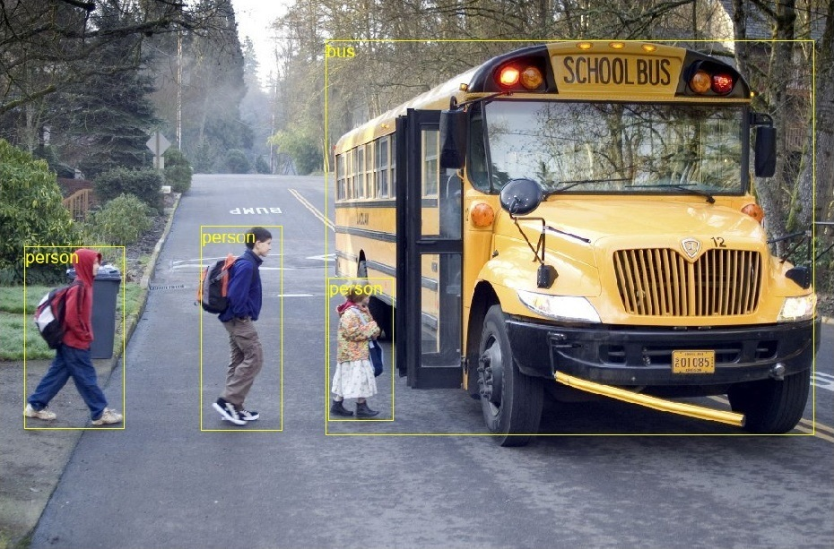
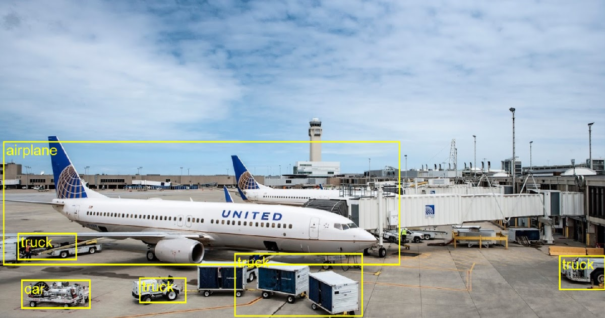

# Running object detection model in C# using onnxruntime


## Installation
Install **python 3+** dependencies.  
```
tensorflow: 1.12.0
onnx: 1.6.0
tf2onnx: 1.5.5
onnxruntime: 1.1.0
```
Download [**ssd_mobilenet_v1_coco**](http://download.tensorflow.org/models/object_detection/ssd_mobilenet_v1_coco_2018_01_28.tar.gz) and move to the root folder.  
Run **ssd2onnx.bat** to convert TensorFlow **saved_model.pb** to **model.onnx**.  

## Code (Python, C#)
Run python script [**object_detection_image_onnx.py**](object_detection_image_onnx.py) to test converted onnx model.  
<p align="center"></p>
<p align="center"><b>Figure 1.</b> Python example</p>  

Build [**C#**](/csharp) source code and run application.  
<p align="center"></p>
<p align="center"><b>Figure 2.</b> C# example</p>  

## References
[1] TensorFlow detection [**model zoo**](https://github.com/tensorflow/models/blob/master/research/object_detection/g3doc/detection_model_zoo.md).  
[2] Tutorial: how to convert them to ONNX and run them under [**onnxruntime**](https://github.com/onnx/tensorflow-onnx/blob/master/tutorials/ConvertingSSDMobilenetToONNX.ipynb).  
[3] Microsoft: ONNX Runtime [**C#**](https://github.com/microsoft/onnxruntime/blob/master/docs/CSharp_API.md) API.  
